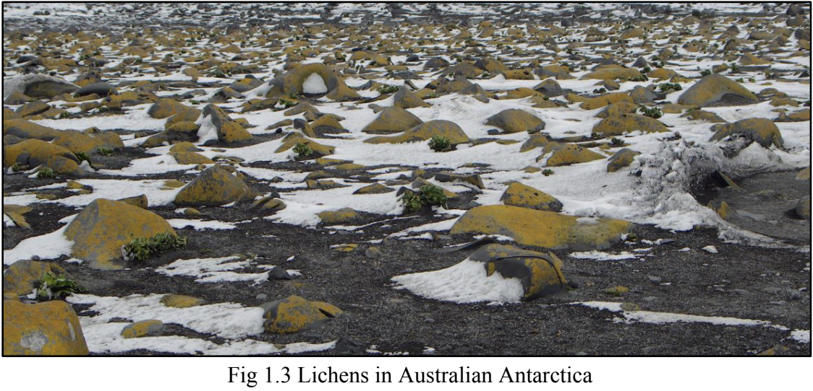
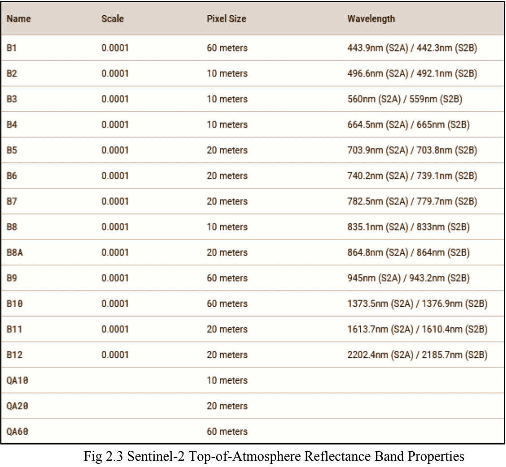
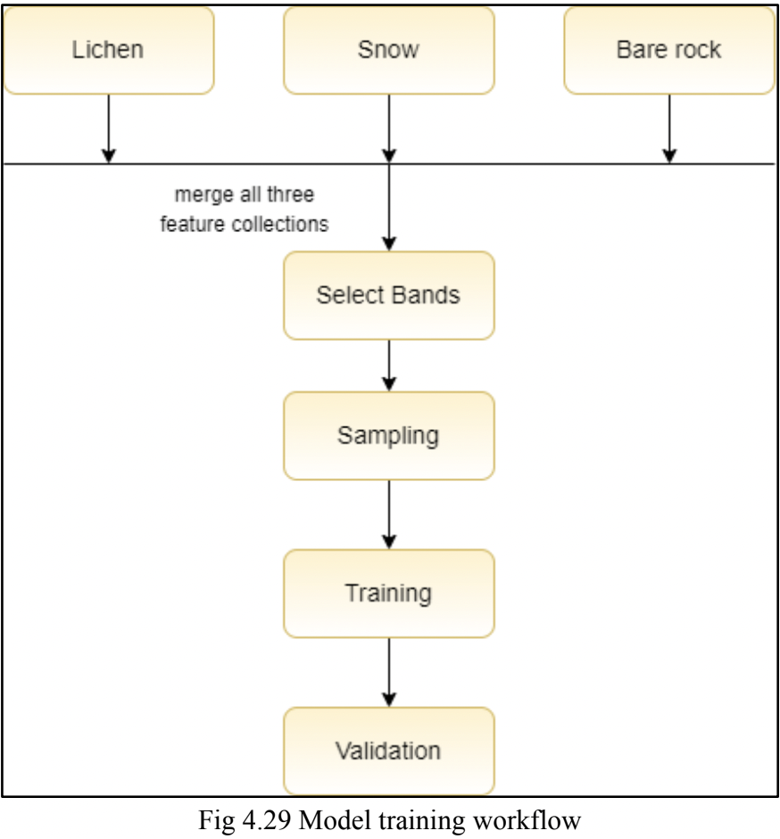
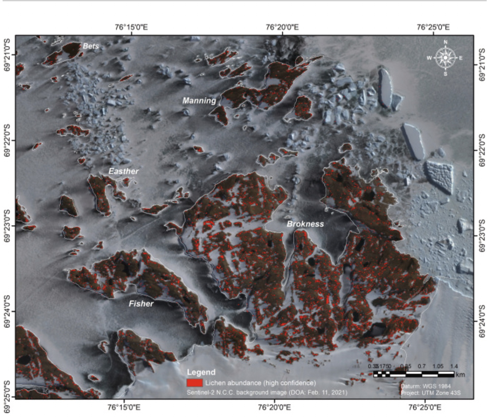

# Lichen Abundance Detection in East Antarctica Using Remote Sensing and Sentinel-2 MSI

**Authors**: Harsh Joshi, Dhruvkumar Kakadiya  
**Advisors**: Prof. Malay S. Bhatt, Dr. Chandra Prakash Singh  
**Institution**: Dharmsinh Desai University  

---

## Overview

This project focuses on detecting and classifying lichen abundance in the Larsemann Hills area of East Antarctica using remote sensing techniques and Sentinel-2 MSI data. The study utilizes machine learning, specifically Random Forest algorithms, to analyze multispectral satellite data for identifying lichen-covered regions.

## Project Goals

1. **Detect and classify lichen in East Antarctica** using Sentinel-2 MSI satellite data.
2. **Employ Random Forest and other machine learning models** for accurate classification.
3. **Analyze spectral reflectance properties** to distinguish between lichens, snow, and bare rocks.
4. **Validate model accuracy** using test regions within Larsemann Hills.

---

## Sentinel-2 MSI Data

- **Sentinel-2 MSI (Multispectral Instrument)**: Captures high-resolution optical images for monitoring vegetation, soil, water cover, and coastal areas.
- **Top-of-Atmosphere Reflectance**: Reflectance measured by space-based sensors that include atmospheric contributions.

| Band Name | Scale | Pixel Size | Wavelength                          |
|-----------|-------|------------|-------------------------------------|
| B1        | 0.0001| 60 meters  | 443.9nm (S2A) / 442.3nm (S2B)       |
| B2        | 0.0001| 10 meters  | 496.6nm (S2A) / 492.1nm (S2B)       |
| B3        | 0.0001| 10 meters  | 560nm (S2A) / 559nm (S2B)           |
| B4        | 0.0001| 10 meters  | 664.5nm (S2A) / 665nm (S2B)         |
| B5-B12    | 0.0001| 20 meters  | Various                             |
| QA10      |       | 10 meters  |                                     |
| QA20      |       | 20 meters  |                                     |
| QA60      |       | 60 meters  |                                     |

*Table 1: Sentinel-2 Top-of-Atmosphere Reflectance Band Properties*

---

## Methodology

### Data Collection

- **Data Sources**: Reflectance spectra from ASD spectrometer for various lichen and non-lichen areas.
- **Sampling Sites**: Fisher North, Manning Island, Grovnes, McLeod Island, Osmar Strait.
- **Satellite Images**: Filtered for the Antarctic summer (October 2020 - February 2021).

### Data Processing

1. **Preprocessing**: Spectral behavior analysis using Python's matplotlib to understand key bands for classification.
2. **Feature Collection**: Created training datasets using Google Earth Engine (GEE) to collect points representing lichens, snow, and bare rocks.

### Model Training and Evaluation

1. **Model Used**: Random Forest (RF) due to its high accuracy in classifying lichen pixels.
2. **Training Regions**: North and South Deception Island, Larsemann Hills.
3. **Evaluation Metrics**: Confusion matrix, resubstitution accuracy, test accuracy on unseen data.

### Workflow

- Combine features from different classes (lichen, snow, bare rock).
- Train models using a variety of trees and validate with different accuracy metrics.

---

## Results

### Model Performance

| Model Configuration | Accuracy (Resubstitution) |
|---------------------|---------------------------|
| RF, 10 Trees        | 95.71%                    |
| RF, 20 Trees        | 97.81%                    |
| RF, 30 Trees        | 98.92%                    |
| CART, No Limit      | 100% (overfitting issue)  |

### Final Classification

- **Lichens Detected**: High confidence in specific regions around Larsemann Hills.
- **Visualization**: Results indicate areas of high lichen abundance, shown in red on classified maps.

---

## Conclusion

- **Best Model**: Random Forest with 20 trees for multi-class classification achieved the highest test accuracy of 85.89%.
- **Future Work**: Development of a user interface for real-time lichen detection and integration with geospatial databases.

---

## Acknowledgments

Special thanks to our guides Prof. Malay S. Bhatt and Dr. Chandra Prakash Singh for their valuable support and guidance throughout this project.

---

## References

1. Sentinel-2 MSI User Guide
2. Google Earth Engine Documentation
3. Polar Research on Lichen Distribution Mapping

---

*Please refer to the project report [CE052_CE055_LichenAbundanceDetection_Report.pdf](CE052_CE055_LichenAbundanceDetection_Report.pdf) for detailed analysis, code implementations, and additional images.*
